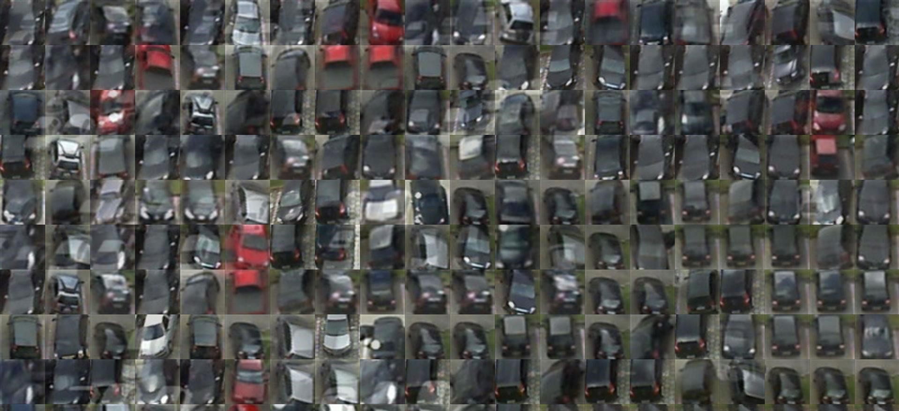
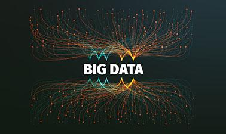
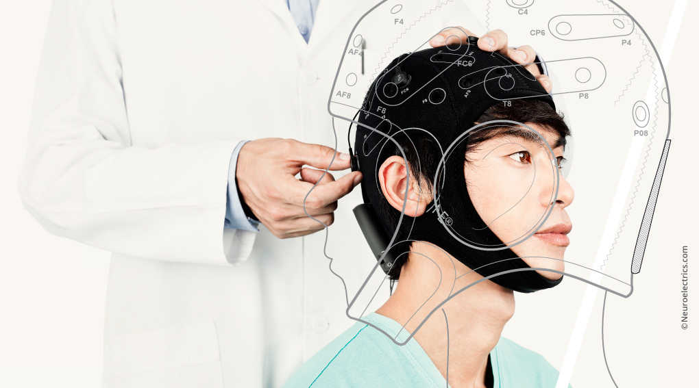

<!-- title: Portfolio
layout: default -->
<!-- <!DOCTYPE html> -->
<html class="no-js">
  <head>
    <meta charset="UTF-8" />
    <meta http-equiv="X-UA-Compatible" content="IE=edge,chrome=1">
    <meta name="viewport" content="width=device-width, initial-scale=1.0">
    <title>Nikhil - Timeline</title>
    <link rel="stylesheet" type="text/css" href="css/timeline.css" />
    
  </head>
  <body>
    

      <header>
        
				<h1>Nikhil</h1>
      </header>
      

        <ul class="cbp_tmtimeline">
          <li>
            

              <h2 id="boxoffice">InstaPark - Smart Parking Solution</h2>
              <time>Sept 2018</time>
							
							<ul>
								<li>
									Poster on Comprehensive Parking Study at the University of Alabama in Huntsville using Airborne sensors secured second place award in the Graduate Master's division at STOH, 2018
								</li>
								<li class="skill">
									<b>Py</b>
									<!--  -->
									<a target="_blank" href="https://cdm16608.contentdm.oclc.org/digital/collection/p16608coll24/id/313/rec/1">Read it</a>
								</li>
							</ul>
						

          </li>

          <li>
						

							<h2 id="boxoffice">InstaPark - Smart Parking Solution</h2>
							<time>April 2018</time>
							
							<ul>
								<li>
									My poster on Comprehensive Parking Study at the University of Alabama in Huntsville using Airborne sensors secured second place award in the Graduate Master's division at 4th Annual Research Horizon Day, UAH
								</li>
								<li class="skill">
									<!--  -->
									<b>Py</b>
									<!--  -->
									<a target="_blank" href="https://cdm16608.contentdm.oclc.org/digital/collection/p16608coll24/id/313/rec/1">Read it</a>
								</li>
							</ul>
						

					</li>

          <li>
						

							<h2 id="boxoffice">Neural Networks and Data Mining Algorithms</h2>
							<time>Jan-April 2018</time>
							
							<ul>
								<li>
                  Implemented algorithms like Kohonen maps, k-nearest neighbors, LDA and QDA in python.
								</li>
								<li class="skill">
									<!--  -->
									<b>Py</b>
									<!--  -->
									<a target="_blank" href="https://github.com/Nikhil0417/DataScience_Projects/tree/master/Algorithms">Source code</a>
								</li>
							</ul>
						

					</li>

          <li>
						

							<h2 id="boxoffice">Empirical Evaluation of Kernel-PCA coupled Classification methods</h2>
							<time>April 2018</time>
							
							<ul>
								<li>
                  Created a classification model that matches the existing classification techniques on the Online News Popularity dataset and outperforms the current techniques on the EEG Eye-state dataset
								</li>
								<li class="skill">
									<!--  -->
									<b>Py</b>
									<!--  -->
									<a target="_blank" href="https://github.com/Nikhil0417/DataScience_Projects/tree/master/EEG%20Eye-state%20Prediction">Source code</a>
								</li>
							</ul>
						

					</li>

          <li>
						

							<h2 id="boxoffice">EEG Signal Processing using MATLAB</h2>
							<time>Jan-May 2014</time>
							
							<ul>
								<li>
                  Processed the raw EEG signals, Classified the signals using machine learning technique SVM and obtained classification rate of 95%.
								</li>
								<li class="skill">
									<!--  -->
									<b>MATLAB</b>
									<!--  -->
									<a target="_blank" href="/doccs/FinalReport_2011AAPS136H.pdf">Read it</a>
								</li>
							</ul>
						

					</li>
  </body>
